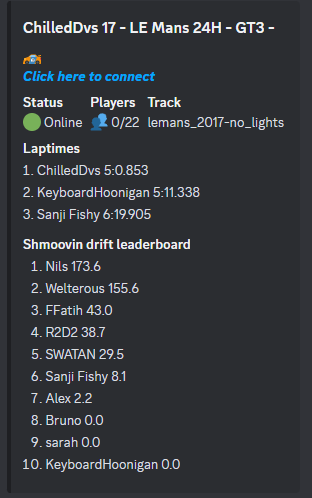

# what does it do:
a server sided script that reads logs from assettoserver for lap times, shmoovin score entries and general server information and posts them to a leaderboard posted via discord webhooks.



it loops trough a parent folder housing all servers and uses a configurable identifier to identify server folders. if it sees a server folder it looks in that folder for a logs folder where it will then loop trough the last log file to find score entries. it will NOT work with different folder structures (example below). it saves the scores and laptimes to a leaderboard txt and a laptimes txt in the root of the server wich can be added manually to remove or reset scores.

If there is no shmoovin script present in the csp config in the server folders cfg folder it will not trigger and leave the folder alone.
It gets the server name from the server config.

laptimes and full server info can be set on or off in the configs as described below.

# how to use:
1. install python on your system from the python website https://www.python.org/downloads/ make sure to select add python to path
2. install the requests module trough pip with the following command in a terminal
```
python -m pip install requests
```
3. create a config folder in the same folder as the script and make a config.json
4. place the following code in the config.json and configure as needed:
```
{
    "interval": time in minutes on how often the script should update the leaderboards,
    "serverspath": "path/to/server_parent_folder (if using docker make this "servers")",
    "folderindentifier": "identifier to recognize server folder",
    "leaderboardlimit": how much entries should be displayed on the leaderboard,
    "webhookurl":"url to your discord webhook",
    "shmoovindrifturl":["url to drift script"],
    "shmoovinovertakeurl":["url to overtake script"],
    "serveradress":"ip adress of server",
    "serveradressdisplay":"ip adress used in bot messages and link (incase serveradress is localhost)",
    "onlyleaderboards":"wether or not to show the full server info or leadeboards only, set to "true" or "false" "
}
```
5. save the file and run the script.

* optionally to ignore laptimes for a certain server you can create a file in the server root with the name "discordbotcfg.ini"
in the file add the following lines:
```
[settings]
showlaptimes = false
```

* alternativly you can build your own docker image with the dockerfile provided or use mine with the following command
```
docker run -dit --name shmoovin-discord-leaderboard -v /path/to/assetto/servers:/usr/src/app/servers -v /path/to/config:/usr/src/app/config keyboardmedic/shmoovin-discord-leaderboard:latest
```


* example folder structure with the identifier set as "(server" :  
-> Assetto servers  
--> (server 1) this is a server  
---> logs  
--> (server 2) this is another server  
---> logs  

* to remove or resend a leaderboard delete the corresponding txt file with the server name in the config folder and manually delete the leaderboard message on discord.

* to remove an entry from the leaderboards delete the entry in the corresponding file (leaderboard.txt or laptimes.txt in the server root) and delete the corresponding log line in the logs

# disclaimer
scripts are written by an amateur, use at your own risk...
