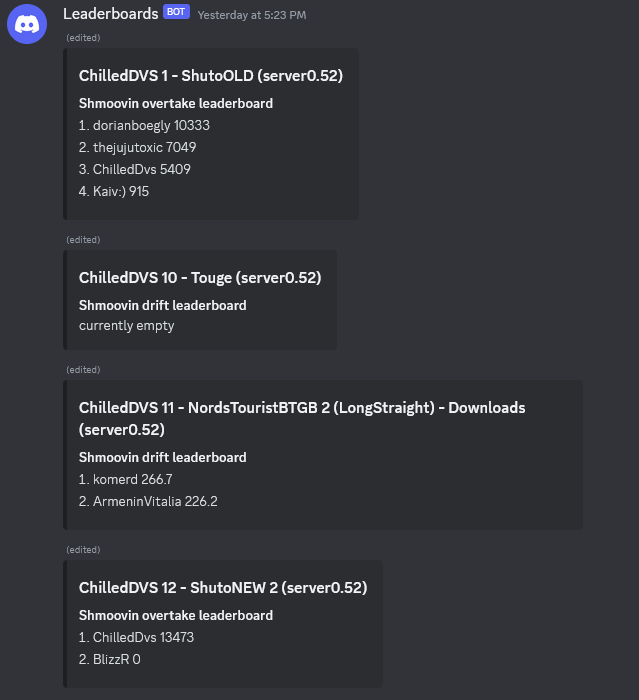

# what does it do:
a server sided script that reads logs from assettoserver for shmoovin score entries and posts them to a leaderboard posted via discord webhooks.


it loops trough a parent folder housing all servers and uses a configurable identifier to identify server folders. if it sees a server folder it looks in that folder for a logs folder where it will then loop trough the last log file to find score entries. it will NOT work with different folder structures (example below). it saves the score to a leaderboard txt in the root of the server wich can be added manually to remove or reset scores.

# how to use:
1. create a config folder in the same folder as the script and make a config.json
2. place the following code in the config.json and configure as needed:
```
{
    "interval": time in minutes on how often the script should update the leaderboards,
    "serverspath": "path/to/server_parent_folder",
    "folderindentifier": "identifier to recognize server folder",
    "leaderboardlimit": how much entries should be displayed on the leaderboard,
    "webhookurl":"url to your discord webhook",
    "shmoovindrifturl":["url to drift script"],
    "shmoovinovertakeurl":["url to overtake script"]
}
```
3. save the file and run the script.


* example folder structure with the identifier set as "(server" :  
-> Assetto servers  
--> (server 1) this is a server  
---> logs  
--> (server 2) this is another server  
---> logs  

* to remove or resend a leaderboard delete the corresponding txt file with the server name in the config folder and manually delete the leaderboard message on discord.

# disclaimer
scripts are written by an amateur, use at your own risk...
